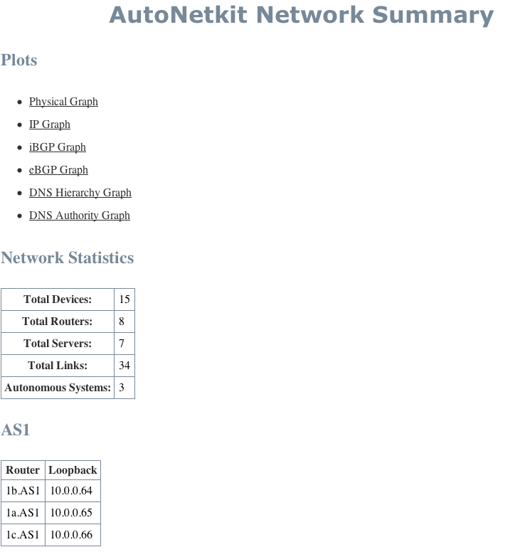
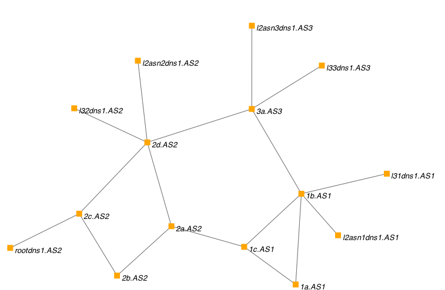
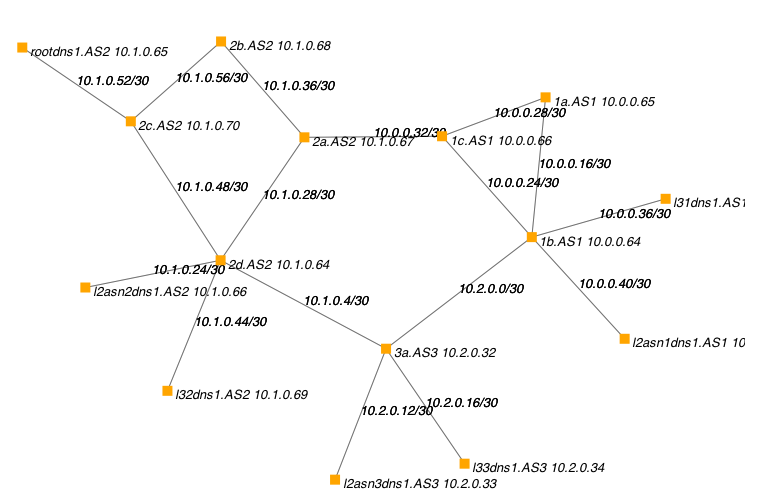
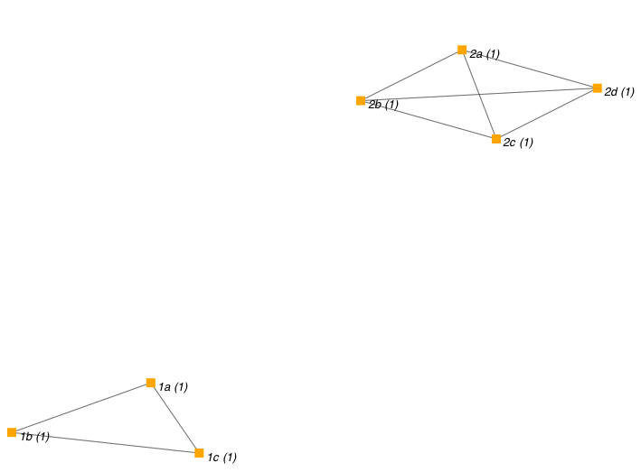
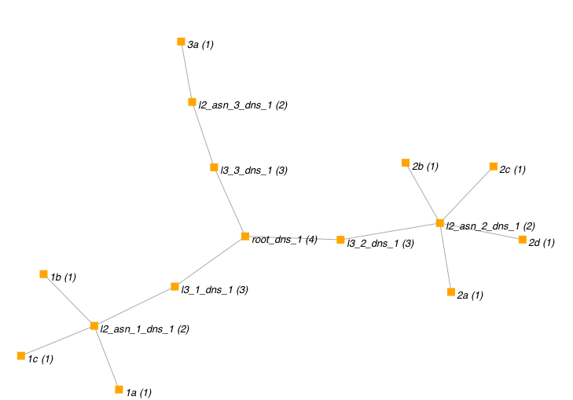
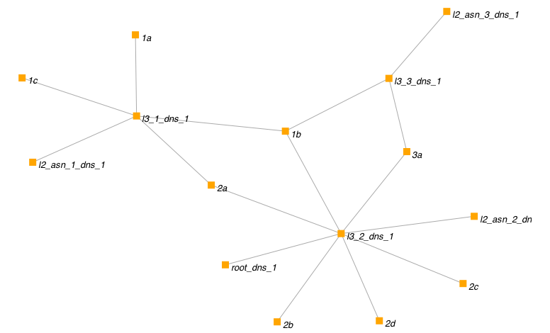

.. _netkit-tutorial:

Netkit Tutorial
===================

Simple example
-----------------  

   
This example builds and deploys a simple single Autonomous System network.

Topologies:

* :download:`Simple Network <../../AutoNetkit/lib/examples/topologies/simple.graphml>`

* :download:`MultiAS Network <../../AutoNetkit/lib/examples/topologies/multias.graphml>`

Code listing
------------------------

If you haven't already installed AutoNetkit, do so using easy_install: ::
    
    easy_install AutoNetkit

When you install AutoNetkit, it will also install the standalone program. You can run this by running ::

	autonetkit 

To get the help:: 

	sk:~ sk2$ autonetkit --help
	Usage: autonetkit [options]

	Options:
	  --version             show program's version number and exit
	  -h, --help            show this help message and exit
	  -p, --plot            Plot lab
	  -d, --deploy          Deploy lab to Netkit host
	  -f FILE, --file=FILE  Load configuration from FILE
	  -n NETKITHOST, --netkithost=NETKITHOST
	                        Netkit host machine (if located on another machine)
	  -u USERNAME, --username=USERNAME
	                        Username for Netkit host machine (if connecting to
	                        external Netkit machine)
	  -v, --verify          Verify lab on Netkit host
	  --xterm               Load each VM console in Xterm  This is the default in
	                        Netkit,  but not ANK due to potentially large number
	                        of VMs
	  --debug               Debugging output
	  --netkit              Compile Netkit
	  --cbgp                Compile cBGP
	  --gns3                Compile GNS3
	  --junos               Compile JunOS
	  --isis                Use IS-IS as IGP
	  --tapsn=TAPSN         Tap subnet to use to connect to VMs. Will be split
	                        into  /24 subnets, with first subnet allocated to
	                        tunnel VM. eg 172.16.0.1 is the linux host, 172.16.0.2
	                        is the  other end of the tunnel    
  

Download the sample topology, and change to that directory on the command line::

	sk:Desktop sk2$ ls
	simple.graphml

From here you can run autonetkit::

	autonetkit -f simple.graphml --netkit

Compiling
---------  

Running the example will give an output similar to:: 

	sk:~ sk2$ autonetkit -f simple.graphml --netkit
	INFO   Loading
	INFO   Compiling
	INFO   Configuring Netkit        

this creates the relevant folders::

	sk:~ sk2$ tree ank_lab/netkit_lab/
	ank_lab/netkit_lab/
	── AS1_Router_A
	│   ── etc
	│       ── hostname
	│       ── resolv.conf
	│       ── zebra
	│           ── bgpd.conf
	│           ── daemons
	│           ── ospfd.conf
	│           ── zebra.conf
	── AS1_Router_A.startup
	── AS1_Router_B
	│   ── etc
	│       ── bind
	│       │   ── db.2.10
	│       │   ── db.AS1
	│       │   ── db.root
	│       │   ── named.conf
	│       ── hostname
	│       ── resolv.conf
	│       ── zebra
	│           ── bgpd.conf
	│           ── daemons
	│           ── ospfd.conf
	│           ── zebra.conf
	── AS1_Router_B.startup  

etc (for each router)

Accessing virtual machines 
--------------------------
To access the virtual machines, AutoNetkit sets up a TUN/TAP subnet. Unfortunately this requires sudo permission to create the initial connection.
This must be provided outside of AutoNetkit --- It is a design decision to not get the user to enter root/sudo passwords into AutoNetkit.

If you have sudo access on the Netkit host machine, you can setup the required tunnel by issuing the following command, on the Linux Netkit host machine::

	vstart taptunnelvm --con0=none --eth0=tap,172.16.0.1,172.16.0.2

You will then need to issue your sudo password.
AutoNetkit will look for a machine named taptunnelvm when it deploys the lab. It assumes that this machine has been setup as by the previous command.

Once you have run this command, you are ready to deploy the lab.  

You can check it is active using ifconfig, where you should have entry similar to the following (but with your username)::

	sknight@trc1:~/autonetkit$ ifconfig 

	nk_tap_sknight Link encap:Ethernet  HWaddr ea:43:6d:b4:8b:bd  
	          inet addr:172.16.0.1  Bcast:172.16.255.255  Mask:255.255.0.0
	          inet6 addr: fe80::e843:6dff:feb4:8bbd/64 Scope:Link
	          UP BROADCAST RUNNING MULTICAST  MTU:1500  Metric:1
	          RX packets:209 errors:0 dropped:0 overruns:0 frame:0
	          TX packets:3 errors:0 dropped:25 overruns:0 carrier:0
	          collisions:0 txqueuelen:500 
	          RX bytes:16318 (16.3 KB)  TX bytes:338 (338.0 B)   

You should be able to check by pinging the host at 172.16.0.2::  

	sknight@trc1:~$ ping 172.16.0.2
	PING 172.16.0.2 (172.16.0.2) 56(84) bytes of data.
	64 bytes from 172.16.0.2: icmp_seq=1 ttl=64 time=1.29 ms
	64 bytes from 172.16.0.2: icmp_seq=2 ttl=64 time=0.232 ms       

Deploying
-----------                

To automatically deploy the lab, use the -d argument. If you are running AutoNetkit on the same machine that is running Netkit, just use -d. You should see the lab started as follows::

	autonetkit@trc1:~$ autonetkit -f simple.graphml --netkit -d
	INFO   Loading
	INFO   Compiling
	INFO   Configuring Netkit
	INFO   Deploying to Netkit
	INFO   Starting lab
	INFO   Checking all previous machines shutdown
	INFO   All previous machines shutdown, starting lab
	INFO   Starting AS1_n1 (1/8)
	INFO   Starting AS2_n4 (2/8)
	INFO   Starting AS1_n3 (3/8)
	INFO   Starting AS2_n2 (4/8)
	INFO   Starting AS1_n0 (5/8)
	INFO   Starting AS2_n6 (6/8)
	INFO   Starting AS2_n7 (7/8)
	INFO   Starting AS3_n5 (8/8)
	INFO   Finished starting Lab, 8 machines started  

If you are running AutoNetkit from another machine (such as a Mac, a different Linux machine, or the same Linux machine but as a different user), you can get AutoNetkit to deploy using SSH.
To do so, specify the -u user and -n netkithost arguments.
Note that this method assumes you have setup ssh keys, such that you can log into the Netkit host machine without a password.

Once you have setup ssh keys, you can deploy to a remote Netkit host as follows::     

  autonetkit -f simple.graphml --netkit -d -n netkithost -u autonetkit

You can also try aarnet, a larger network. This network can be found in the
Internet Topology Zoo, at www.topology-zoo.org. Download the file http://topology-zoo.org/files/Aarnet.gml ::

	sk:~ sk2$ autonetkit -f Aarnet.gml --netkit -d -n netkithost -u autonetkit
	INFO   Loading
	INFO   Compiling
	INFO   Configuring Netkit
	INFO   Deploying to Netkit
	INFO   Connecting to netkithost
	INFO   Connected to netkithost
	INFO   Copying Lab over
	INFO   Starting lab
	INFO   Checking all previous machines shutdown
	INFO   All previous machines shutdown, starting lab
	INFO   Starting AARNET_Adelaide1 (1/19)
	INFO   Starting AARNET_Alice_Springs (2/19)
	INFO   Starting AARNET_Adelaide2 (3/19)
	INFO   Starting AARNET_Brisbane1 (4/19)
	INFO   Starting AARNET_Armidale (5/19)
	INFO   Starting AARNET_Brisbane2 (6/19)
	INFO   Starting AARNET_Cairns (7/19)
	INFO   Starting AARNET_Canberra1 (8/19)
	INFO   Starting AARNET_Canberra2 (9/19)
	INFO   Starting AARNET_Darwin (10/19)
	INFO   Starting AARNET_Hobart (11/19)
	INFO   Starting AARNET_Melbourne1 (12/19)
	INFO   Starting AARNET_Melbourne2 (13/19)
	INFO   Starting AARNET_Perth1 (14/19)
	INFO   Starting AARNET_Perth2 (15/19)
	INFO   Starting AARNET_Rockhampton (16/19)
	INFO   Starting AARNET_Sydney1 (17/19)
	INFO   Starting AARNET_Sydney2 (18/19)
	INFO   Starting AARNET_Townsville (19/19)
	INFO   Finished starting Lab, 19 machines started  
  
Logging into virtual machines
------------------------------
Assuming you have setup the tap host, and deployed the lab, you should now be able to access the lab.
If you are on an external machine, ssh into the Linux Netkit host. If you are already on the Netkit host, you are ready to go.

Each machine is assigned an IP address inside the TAP subnet, to which you can ssh to. These IPs are allocated per AS, so the first AS has the range
172.16.1.x, the second has 172.16.2.x, etc
The first host in the first AS has 172.16.1.1, the second 172.16.1.2, etc

You can check the allocations in the lab.conf file, inside the ank_lab/netkit_lab/ directory::

	AARNET_Adelaide1[8]=tap,172.16.0.1,172.16.0.3
	AARNET_Adelaide2[8]=tap,172.16.0.1,172.16.0.4
	AARNET_Alice_Springs[4]=tap,172.16.0.1,172.16.0.5
	AARNET_Armidale[2]=tap,172.16.0.1,172.16.0.6
	AARNET_Brisbane1[6]=tap,172.16.0.1,172.16.0.7
	AARNET_Brisbane2[4]=tap,172.16.0.1,172.16.0.8
	AARNET_Cairns[2]=tap,172.16.0.1,172.16.0.9
	AARNET_Canberra1[4]=tap,172.16.0.1,172.16.0.10
	AARNET_Canberra2[4]=tap,172.16.0.1,172.16.0.11
	AARNET_Darwin[4]=tap,172.16.0.1,172.16.0.12
	AARNET_Hobart[4]=tap,172.16.0.1,172.16.0.13
	AARNET_Melbourne1[8]=tap,172.16.0.1,172.16.0.14
	AARNET_Melbourne2[8]=tap,172.16.0.1,172.16.0.15
	AARNET_Perth1[4]=tap,172.16.0.1,172.16.0.16
	AARNET_Perth2[4]=tap,172.16.0.1,172.16.0.17
	AARNET_Rockhampton[4]=tap,172.16.0.1,172.16.0.18
	AARNET_Sydney1[6]=tap,172.16.0.1,172.16.0.19
	AARNET_Sydney2[8]=tap,172.16.0.1,172.16.0.20
	AARNET_Townsville[4]=tap,172.16.0.1,172.16.0.21     

The first element is the name of the virtual machine (eg 1_AA), and the last IP on each line is the IP the machine can be reached at. (The 172.16.0.1 IP is the Linux host). 
You can ssh into each machine as the "root" user, with the default password of "1234"::

	autonetkit@trc1:~$ ssh root@172.16.0.3 
	root@172.16.0.3's password: 
	Last login: Mon Oct 24 04:51:19 2011
	Adelaide1_AARNET:~#  

Here you can check DNS is working, and use standard diagnostic tools::

	AS1rA:~# ping AS1rB
	PING lo0.AS1rB.AS1 (10.0.0.16) 56(84) bytes of data.
	64 bytes from lo0.AS1rB.AS1 (10.0.0.16): icmp_seq=1 ttl=64 time=0.205 ms
	64 bytes from lo0.AS1rB.AS1 (10.0.0.16): icmp_seq=2 ttl=64 time=0.122 ms   
	
	AS1rA:~# traceroute AS1rC
	traceroute to lo0.AS1rC.AS1 (10.0.0.17), 64 hops max, 40 byte packets
	 1  eth2.AS1rB.AS1 (10.0.0.5)  0 ms  0 ms  0 ms
	 2  lo0.AS1rC.AS1 (10.0.0.17)  0 ms  0 ms  0 ms

and for the larger network::

	AS1rper1:~# traceroute cns1
	traceroute to lo0.AS1rcns1.AS1 (10.0.0.128), 64 hops max, 40 byte packets
	 1  eth0.AS1rper2.AS1 (10.0.0.93)  1 ms  0 ms  2 ms
	 2  eth0.AS1radl2.AS1 (10.0.0.61)  0 ms  1 ms  0 ms
	 3  eth2.AS1rmel2.AS1 (10.0.0.21)  1 ms  0 ms  0 ms
	 4  eth0.AS1rmel1.AS1 (10.0.0.18)  1 ms  0 ms  1 ms
	 5  eth2.AS1rsyd1.AS1 (10.0.0.34)  1 ms  1 ms  1 ms
	 6  eth1.AS1rbne1.AS1 (10.0.0.70)  1 ms  1 ms  1 ms
	 7  eth0.AS1rbne2.AS1 (10.0.0.49)  1 ms  1 ms  1 ms
	 8  eth0.AS1rrok1.AS1 (10.0.0.54)  1 ms  1 ms  1 ms
	 9  eth1.AS1rtsv1.AS1 (10.0.0.81)  1 ms  1 ms  1 ms
	10  lo0.AS1rcns1.AS1 (10.0.0.128)  1 ms  1 ms  1 ms   

You can also directly telnet into the machine, for zebra, ospfd or bgpd (if the router is running bgp). The default password for each of these is "z"::

	sknight@trc1:~$ telnet 172.16.1.1 zebra
	Trying 172.16.1.1...
	Connected to 172.16.1.1.
	Escape character is '^]'.

	Hello, this is Quagga (version 0.99.10).
	Copyright 1996-2005 Kunihiro Ishiguro, et al.

	User Access Verification

	Password: 
	AS1rA.AS1> en
	Password: 
	AS1rA.AS1#  

and issue Quagga commands::

	AS1rA.AS1# sh ip route 
	Codes: K - kernel route, C - connected, S - static, R - RIP, O - OSPF,
	       I - ISIS, B - BGP, > - selected route, * - FIB route

	O>* 10.0.0.0/30 [110/2] via 10.0.0.5, eth0, 00:04:33
	O   10.0.0.4/30 [110/1] is directly connected, eth0, 00:05:16
	C>* 10.0.0.4/30 is directly connected, eth0
	O   10.0.0.8/30 [110/1] is directly connected, eth1, 00:04:52
	C>* 10.0.0.8/30 is directly connected, eth1
	O>* 10.0.0.16/32 [110/2] via 10.0.0.5, eth0, 00:04:33
	O>* 10.0.0.17/32 [110/3] via 10.0.0.5, eth0, 00:04:33
	O   10.0.0.18/32 [110/1] is directly connected, lo, 00:05:16
	C>* 10.0.0.18/32 is directly connected, lo
	O>* 10.0.3.0/30 [110/20] via 10.0.0.5, eth0, 00:04:32
	O>* 10.0.3.4/30 [110/20] via 10.0.0.5, eth0, 00:04:32
	C>* 127.0.0.0/8 is directly connected, lo
	O   172.16.0.0/16 [110/20] via 10.0.0.5, eth0, 00:04:32
	C>* 172.16.0.0/16 is directly connected, eth2
	AS1rA.AS1#   

for ospfd:: 

	sknight@trc1:~$ telnet 172.16.1.1 ospfd
	Trying 172.16.1.1...
	Connected to 172.16.1.1.
	Escape character is '^]'.

	Hello, this is Quagga (version 0.99.10).
	Copyright 1996-2005 Kunihiro Ishiguro, et al.

	User Access Verification

	Password: 
	AS1rA.AS1> sh ip ospf neighbor 

	    Neighbor ID Pri State           Dead Time Address         Interface            RXmtL RqstL DBsmL
	10.0.0.16         1 Full/Backup       36.376s 10.0.0.5        eth0:10.0.0.6            0     0     0
	10.0.0.129        1 Full/DROther      36.680s 10.0.0.9        eth1:10.0.0.10           0     0     0
	AS1rA.AS1>

and for bgpd::   

	sknight@trc1:~$ telnet 172.16.1.2 bgpd
	Trying 172.16.1.2...
	Connected to 172.16.1.2.
	Escape character is '^]'.

	Hello, this is Quagga (version 0.99.10).
	Copyright 1996-2005 Kunihiro Ishiguro, et al.

	User Access Verification

	Password: 
	AS1rB.AS1> en
	AS1rB.AS1# sh ip bgp 
	BGP table version is 0, local router ID is 10.0.0.16
	Status codes: s suppressed, d damped, h history, * valid, > best, i - internal,
	              r RIB-failure, S Stale, R Removed
	Origin codes: i - IGP, e - EGP, ? - incomplete

	   Network          Next Hop            Metric LocPrf Weight Path
	*> 10.0.0.0/30      0.0.0.0                  1         32768 ?
	*> 10.0.0.4/30      0.0.0.0                  1         32768 ?
	*> 10.0.0.16/32     0.0.0.0                  1         32768 ?
	*> 10.0.3.0/30      0.0.0.0                  1         32768 ?
	*> 172.16.0.0       0.0.0.0                  1         32768 ?

	Total number of prefixes 5
	AS1rB.AS1#        

and::      

	AS1rB.AS1# sh ip bgp summary 
	BGP router identifier 10.0.0.16, local AS number 1
	RIB entries 9, using 576 bytes of memory
	Peers 2, using 5032 bytes of memory

	Neighbor        V    AS MsgRcvd MsgSent   TblVer  InQ OutQ Up/Down  State/PfxRcd
	10.0.0.17       4     1       0       5        0    0    0 never    Active     
	10.0.1.1        4     2       0       0        0    0    0 never    Active     

	Total number of neighbors 2       

            
Plotting
---------  

Plotting can be enabled using the ``--plot`` switch::

	sk:Desktop sk2$ autonetkit -f simple.graphml --netkit --plot
	INFO   Loading
	INFO   Compiling
	INFO   Configuring IGP
	INFO   Configuring BGP
	INFO   Configuring DNS
	INFO   Plotting

We can see the plotting step has been completed. You can access the plots through the HTML summary page::
  
  ank_lab/plots/summary.html

Examples of plotting and summary:

Summary:

Physical:

IP Addresses:

                     
iBGP:

eBGP:

DNS:

DNS Authority (who advertises who)

